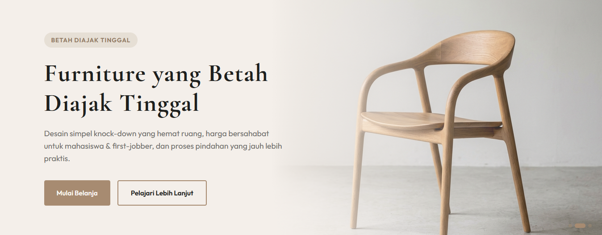
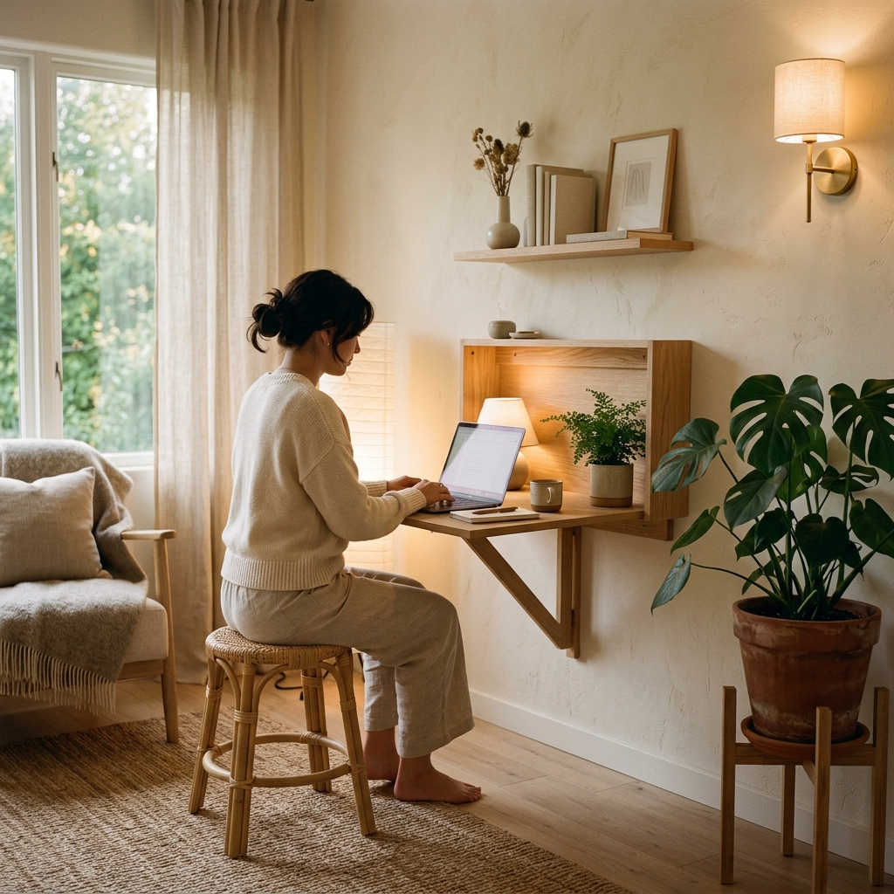
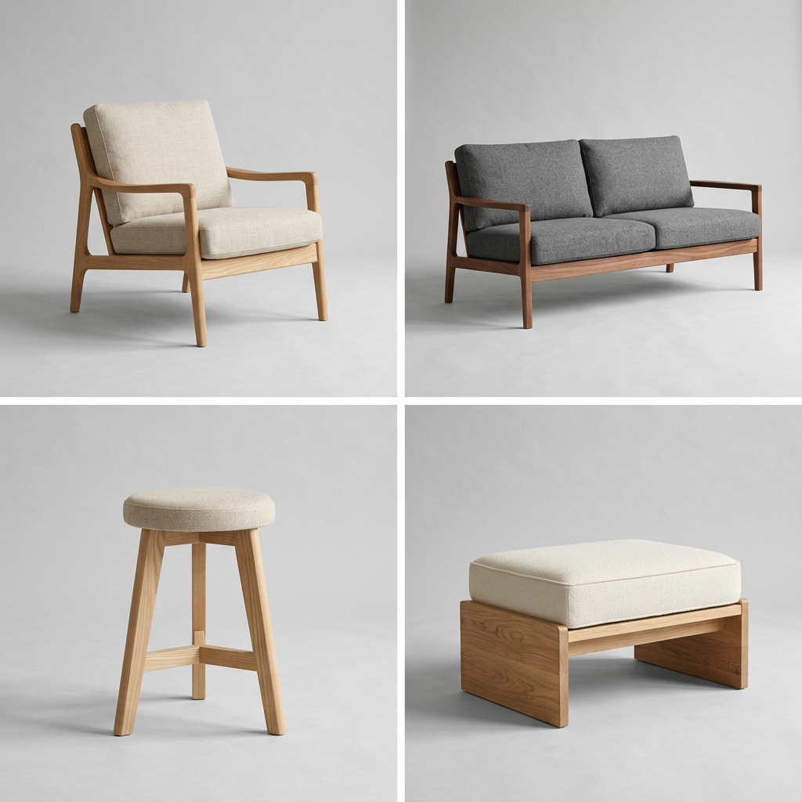
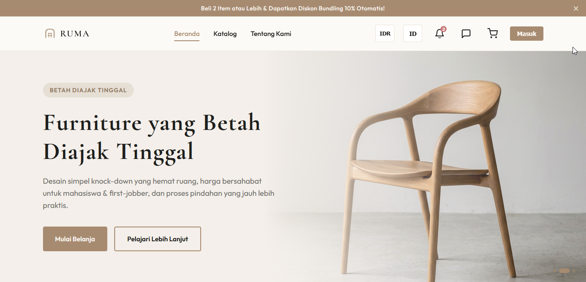
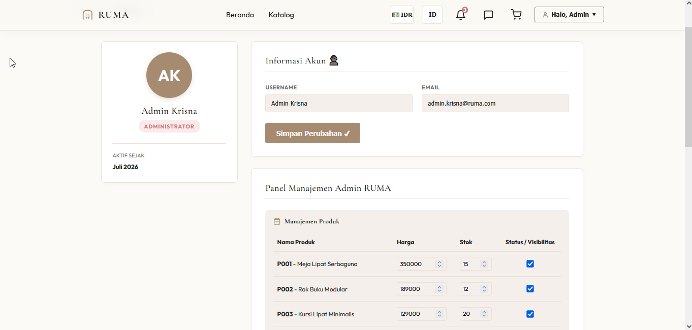
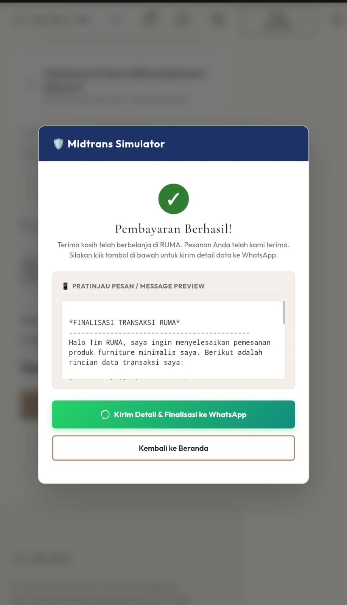
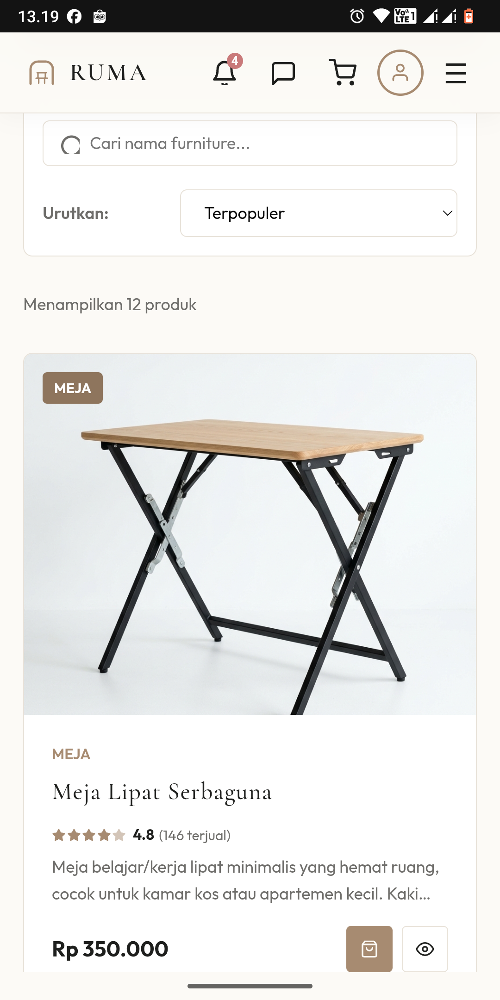

<div align="center">

# RUMA
### *"Furniture yang Betah Diajak Tinggal"*


**Website E-Commerce Furniture Minimalis untuk Anak Kos & First Apartment**

**Live Demo:** [https://krisna-b.github.io/RUMA_Final-Project_UAS/](#)

**Live Website:** https://krisna-b.github.io/RUMA_Final-Project_UAS

</div>

---

<p align="center">
  
</p>

---

## 📋 Daftar Isi

1. [Tentang RUMA](#-tentang-ruma)
2. [Target Market & Segmentasi](#-target-market--segmentasi)
3. [Analisis Pasar & Kompetitor](#-analisis-pasar--kompetitor)
4. [Katalog Produk](#-katalog-produk)
5. [Model Bisnis & Revenue Stream](#-model-bisnis--revenue-stream)
6. [Strategi Harga & Promosi](#-strategi-harga--promosi)
7. [Fitur Website](#-fitur-website)
8. [Struktur Halaman](#-struktur-halaman)
9. [Proses Checkout & Payment Gateway](#-proses-checkout--payment-gateway)
10. [SEO, Keamanan & Pemeliharaan](#-seo-keamanan--pemeliharaan)
11. [Tech Stack](#-tech-stack)
12. [Struktur Folder Proyek](#-struktur-folder-proyek)
13. [Cara Menjalankan Proyek](#-cara-menjalankan-proyek)
14. [Screenshot Website](#-screenshot-website)
15. [Tim Pengembang](#-tim-pengembang)

---

## 🏠 Tentang RUMA

**RUMA** adalah brand furniture lokal yang lahir dari masalah sehari-hari: kamar kos, apartemen studio, dan rumah kontrakan yang serba terbatas ruangnya, tapi tetap butuh furniture yang fungsional dan enak dilihat.

RUMA hadir dengan furniture **knock-down** (rakit sendiri), desain minimalis, dan harga yang masuk akal untuk kantong mahasiswa dan first-jobber.

> **Value Proposition:**
> Desain simpel yang hemat ruang, harga terjangkau, dan sistem rakit-sendiri yang bikin ongkir dan proses pindahan jauh lebih ringan.

<p align="center">
  
</p>

---

## 🎯 Target Market & Segmentasi

| Segmen | Deskripsi |
|---|---|
| **Usia** | 20–30 tahun |
| **Status** | Mahasiswa tingkat akhir, first-jobber, pasangan muda |
| **Tempat tinggal** | Kos, apartemen studio, rumah kontrakan |
| **Kebutuhan** | Furniture fungsional, mudah dipindah, tidak makan tempat |
| **Perilaku belanja** | Aktif belanja online, sensitif harga, cari ulasan sebelum beli |

---

## 📊 Analisis Pasar & Kompetitor

| Kompetitor | Kekuatan | Kelemahan | Posisi RUMA |
|---|---|---|---|
| **IKEA** | Desain kuat, kualitas terjamin | Harga relatif tinggi, toko terbatas | RUMA lebih terjangkau, full online |
| **Informa** | Jaringan toko luas | Furniture cenderung besar, kurang cocok ruang sempit | RUMA fokus ke ruang kecil |
| **Toko online lokal (Shopee/Tokopedia)** | Harga murah | Kualitas tidak konsisten, tanpa identitas brand | RUMA punya standar kualitas & branding jelas |

**Diferensiasi RUMA:** desain se-niat brand besar, harga se-ramah toko online lokal, dengan sistem rakit sendiri sebagai nilai jual utama.

---

## 🛒 Katalog Produk

Katalog awal RUMA terdiri dari 10 kategori produk:

| No | Produk | Kategori | Deskripsi Singkat |
|---|---|---|---|
| 1 | Meja Lipat Serbaguna | Meja | Meja belajar/kerja lipat, hemat ruang |
| 2 | Rak Buku Modular | Rak | Bisa disusun sesuai kebutuhan |
| 3 | Kursi Lipat Minimalis | Kursi | Ringan, mudah disimpan |
| 4 | Lemari Pakaian Portable | Lemari | Rangka kain, mudah dibongkar pasang |
| 5 | Meja Kerja Minimalis | Meja | Desain clean untuk WFH |
| 6 | Rak Sepatu Compact | Rak | Muat banyak, tidak makan tempat |
| 7 | Nakas Samping Tempat Tidur | Nakas | Ukuran kecil, fungsional |
| 8 | Partisi Ruangan Lipat | Partisi | Sekat ruangan portable |
| 9 | Kursi Gaming Budget | Kursi | Ergonomis, harga terjangkau |
| 10 | Meja Ruang Tamu | Meja | Desain estetik dan fungsional |

<p align="center">
  
</p>

---

## 💰 Model Bisnis & Revenue Stream

- **Penjualan langsung produk** — sumber pendapatan utama
- **Jasa rakit (add-on saat checkout)** — biaya tambahan opsional bagi pelanggan yang tidak mau rakit sendiri
- **Bundle diskon** — beli 2 item atau lebih, diskon 10%

## 🏷️ Strategi Harga & Promosi

- **Penetapan harga:** kompetitif, sedikit di bawah rata-rata harga furniture serupa di marketplace besar
- **Promosi:**
  - Diskon bundling (beli 2+ dapat potongan)
  - Diskon first purchase untuk pelanggan baru
  - Flash sale periodik (ditampilkan di hero banner)
- **Loyalty:** kode referral untuk pelanggan yang mengajak teman

---

## ✨ Fitur Website

### Fitur Utama
- 🛍️ **Katalog Produk** — 10 produk lengkap dengan gambar, harga, dan deskripsi
- 🔍 **Filter & Search** — filter berdasarkan kategori, rentang harga, dan pencarian nama produk
- 🖼️ **Detail Produk (Modal)** — info lengkap, gambar, dan tombol Add to Cart tanpa pindah halaman
- 🛒 **Keranjang Belanja** — tambah produk, ubah kuantitas, hapus item, total harga otomatis, tersimpan di `localStorage` (tidak hilang saat refresh)
- 💳 **Checkout** — form data pelanggan + validasi input + simulasi pembayaran (Midtrans dummy)
- 📱 **Responsive Design** — tampilan optimal di desktop, tablet, dan mobile
- 🎨 **UI Modern** — Flexbox & Grid layout, warna brand konsisten, animasi scroll halus

### Fitur Tambahan
- Smooth scrolling antar section
- Notifikasi toast saat produk ditambahkan ke keranjang
- Badge diskon otomatis pada produk bundling

---

## 🗺️ Struktur Halaman

| Halaman | Isi |
|---|---|
| **`index.html`** | Navbar, Hero Banner, produk unggulan, testimoni, footer |
| **`katalog.html`** | Grid produk lengkap + filter & search |
| **`profile.html`** | terpisah, infomasi dari akun
| **Modal Detail Produk** | Muncul dari katalog, tidak perlu halaman terpisah |
| **Keranjang Belanja** | Sidebar/modal, dapat diakses dari navbar mana saja |
| **`checkout.html`** | Form data diri, ringkasan pesanan, simulasi pembayaran |
| **Footer** | Kontak, sosial media, link ke Business Overview |

---

## 💳 Proses Checkout & Payment Gateway

1. Pelanggan menambahkan produk ke keranjang
2. Review keranjang → klik "Checkout"
3. Isi form data diri (nama, alamat, kontak) — divalidasi dengan JavaScript
4. Pilih metode pembayaran (simulasi **Midtrans**)
5. Konfirmasi pesanan → tampil halaman sukses (dummy)

*Midtrans dipilih sebagai simulasi karena merupakan payment gateway paling umum digunakan UMKM/e-commerce lokal di Indonesia dan dokumentasinya lengkap untuk keperluan pembelajaran.*

---

## 🔒 SEO, Keamanan & Pemeliharaan

- **SEO:** meta tag deskriptif, alt text pada semua gambar produk, struktur heading yang semantik (h1–h3)
- **Keamanan:** validasi input form di sisi client, sanitasi sederhana untuk mencegah input tidak wajar
- **Pemeliharaan:** update katalog produk berkala, cek broken link/gambar, monitoring performa via Analytics

---

## 🛠️ Tech Stack

- **HTML5** — struktur halaman
- **CSS3** — Flexbox & Grid, media query untuk responsive design
- **JavaScript (ES6+)** — interaktivitas (cart, filter, validasi form)
- **localStorage** — penyimpanan data keranjang belanja
- **Git & GitHub** — version control
- **GitHub Pages** — hosting/deployment

---

## 📁 Struktur Folder Proyek

```
ruma/
├── checkout.html
├── index.html
├── katalog.html
├── profle.html
├── css/
│   ├── style.css         <-- CSS Utama, Desain Toko, & Layout Global
│   └── responsive.css    <-- Media Queries responsif (Desktop, Tablet, Mobile)
├── js/
│   ├── products.js       <-- Centralized Database 10 Produk
│   ├── cart.js           <-- Manajemen Keranjang Belanja & localStorage
│   ├── filter.js         <-- Logika filter pencarian real-time & detail modal
│   └── checkout.js       <-- Validasi data pelanggan & Midtrans Simulator
├── images/
│   ├── banner-hero.jpg
│   ├── about-lifestyle.jpg
│   ├── catalog-preview.jpg
│   └── products/
│       ├── meja-lipat.jpg
│       ├── rak-buku.jpg
│       └── ...
└── README.md
```

---

## ⚙️ Penjelasan Teknis & Arsitektur Kode

Untuk memenuhi kriteria kebersihan kode, modularitas, dan pemeliharaan jangka panjang, website RUMA menggunakan arsitektur front-end berbasis JavaScript murni (Vanilla JS) dengan beberapa mekanisme utama:

1. **Penyimpanan Data Produk Terpusat (`js/products.js`)**
   - Seluruh spesifikasi produk, harga, stok, deskripsi, dan gambar disimpan dalam array object terpusat. Hal ini mempermudah pembaruan katalog tanpa harus mengubah kode HTML di banyak tempat (*Single Source of Truth*).

2. **Manajemen Keranjang Belanja Persisten (`js/cart.js`)**
   - Ikut menyimpan keranjang belanja ke dalam browser `localStorage` sebagai JSON string (`ruma_cart`). Data keranjang tetap aman saat halaman dimuat ulang (*refresh*) atau berpindah halaman.
   - Perubahan kuantitas produk memicu pembaruan badge ikon keranjang secara instan dan sinkron di semua halaman.

3. **Mesin Filter & Pencarian Katalog Tanpa Reload (`js/filter.js`)**
   - Input pencarian mendeteksi ketikan pengguna secara *real-time* (`input` event).
   - Pengurutan harga (*Sorting*) dan penyaringan kategori bekerja secara kumulatif untuk menyaring array produk secara cepat sebelum ditampilkan kembali di layar menggunakan manipulasi DOM.

4. **Sistem Validasi & Simulator Midtrans (`js/checkout.js`)**
   - Formulir pengiriman melakukan validasi regex untuk memverifikasi keabsahan data email, nomor telepon (10-13 digit angka), serta kode pos (5 digit angka).
   - Simulator Midtrans bertindak sebagai simulasi gerbang pembayaran (*payment gateway*) dengan menampilkan instruksi pembayaran Virtual Account bank secara acak dan kode QRIS dummy, disertai tombol penyelesaian transaksi sukses untuk mengosongkan keranjang.

5. **Pelacakan Perilaku Pengguna (Google Analytics Dummy)**
   - Script analytics disematkan di setiap halaman. Ketika interaksi penting terjadi (seperti pageview, menambah produk ke keranjang, mengganti kuantitas, memvalidasi form, atau sukses transaksi), sebuah fungsi `trackGAEvent` dipicu untuk mencetak log GA ke konsol browser sebagai simulasi analitik data-driven.

---

## 📸 Screenshot Website

### 🖥️ Tampilan Dekstop

| Beranda | Profile |
|---|---|
|  |  |

### 📱 Tampilan Mobile

| Validasi Pembayaran | Katalog|
|---|---|
|  |  |

---

## 👤 Tim Pengembang

| Nama | NIM | Peran |
|---|---|---|
| Krisna Bagja | 209250190 | Mahasiswa ABI 8|

---

<div align="center">

**RUMA** — Furniture yang Betah Diajak Tinggal

*Dibuat untuk memenuhi tugas KAIT II — Program Studi Administrasi Bisnis, IWU*

</div>
