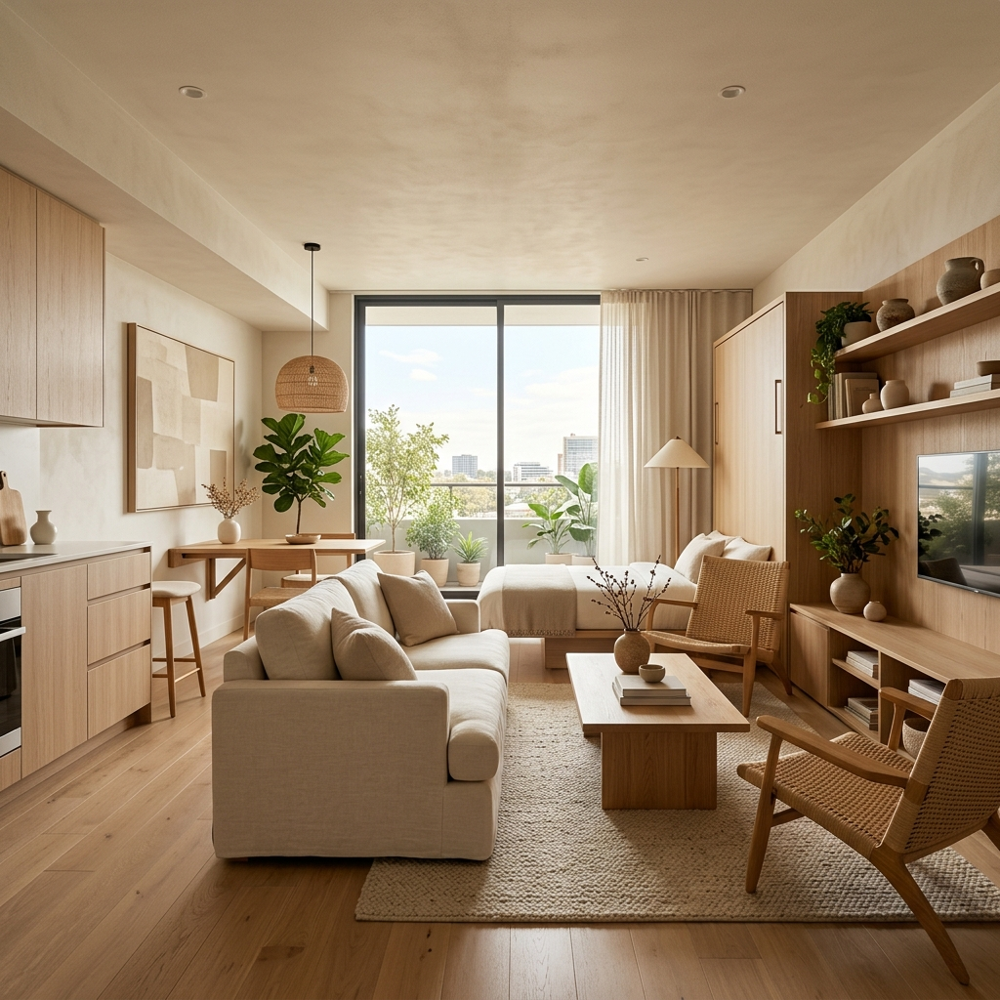

<div align="center">

# 🛋️ RUMA
### *"Furniture yang Betah Diajak Tinggal"*


**Website E-Commerce Furniture Minimalis untuk Anak Kos & First Apartment**

[Live Demo](#) · [Laporan Bug](#) · [Ajukan Fitur](#)

</div>

---

<!--
BANNER UTAMA
Ganti placeholder di bawah ini dengan gambar hero banner RUMA (ukuran disarankan: 1600x600px).
Rekomendasi sumber gratis (Unsplash) sesuai tema furniture minimalis:
https://unsplash.com/s/photos/minimalist-furniture
https://unsplash.com/s/photos/apartment-interior
Simpan sebagai: images/banner-hero.jpg lalu update src di bawah.
-->
<p align="center">
  
  <br>
  <em>🖼️ [Placeholder Banner Hero — ganti dengan foto ruangan minimalis berisi furniture RUMA]</em>
</p>

---

## 📋 Daftar Isi

1. [Tentang RUMA](#-tentang-ruma)
2. [Target Market & Segmentasi](#-target-market--segmentasi)
3. [Analisis Pasar & Kompetitor](#-analisis-pasar--kompetitor)
4. [Katalog Produk](#-katalog-produk)
5. [Model Bisnis & Revenue Stream](#-model-bisnis--revenue-stream)
6. [Strategi Harga & Promosi](#-strategi-harga--promosi)
7. [Fitur Website](#-fitur-website)
8. [Struktur Halaman](#-struktur-halaman)
9. [Proses Checkout & Payment Gateway](#-proses-checkout--payment-gateway)
10. [SEO, Keamanan & Pemeliharaan](#-seo-keamanan--pemeliharaan)
11. [Data Analytics](#-data-analytics)
12. [Tech Stack](#-tech-stack)
13. [Struktur Folder Proyek](#-struktur-folder-proyek)
14. [Cara Menjalankan Proyek](#-cara-menjalankan-proyek)
15. [Screenshot Website](#-screenshot-website)
16. [Tim Pengembang](#-tim-pengembang)

---

## 🏠 Tentang RUMA

**RUMA** adalah brand furniture lokal yang lahir dari masalah sehari-hari: kamar kos, apartemen studio, dan rumah kontrakan yang serba terbatas ruangnya, tapi tetap butuh furniture yang fungsional dan enak dilihat.

RUMA hadir dengan furniture **knock-down** (rakit sendiri), desain minimalis, dan harga yang masuk akal untuk kantong mahasiswa dan first-jobber.

> **Value Proposition:**
> Desain simpel yang hemat ruang, harga terjangkau, dan sistem rakit-sendiri yang bikin ongkir dan proses pindahan jauh lebih ringan.

<!--
GAMBAR PENDUKUNG 1
Rekomendasi: foto produk furniture terpasang di ruangan kecil
Sumber: https://unsplash.com/s/photos/small-space-furniture
-->
<p align="center">
  
  <br>
  <em>🖼️ [Placeholder — foto lifestyle: furniture RUMA di kamar kos/apartemen kecil]</em>
</p>

---

## 🎯 Target Market & Segmentasi

| Segmen | Deskripsi |
|---|---|
| **Usia** | 20–30 tahun |
| **Status** | Mahasiswa tingkat akhir, first-jobber, pasangan muda |
| **Tempat tinggal** | Kos, apartemen studio, rumah kontrakan |
| **Kebutuhan** | Furniture fungsional, mudah dipindah, tidak makan tempat |
| **Perilaku belanja** | Aktif belanja online, sensitif harga, cari ulasan sebelum beli |

---

## 📊 Analisis Pasar & Kompetitor

| Kompetitor | Kekuatan | Kelemahan | Posisi RUMA |
|---|---|---|---|
| **IKEA** | Desain kuat, kualitas terjamin | Harga relatif tinggi, toko terbatas | RUMA lebih terjangkau, full online |
| **Informa** | Jaringan toko luas | Furniture cenderung besar, kurang cocok ruang sempit | RUMA fokus ke ruang kecil |
| **Toko online lokal (Shopee/Tokopedia)** | Harga murah | Kualitas tidak konsisten, tanpa identitas brand | RUMA punya standar kualitas & branding jelas |

**Diferensiasi RUMA:** desain se-niat brand besar, harga se-ramah toko online lokal, dengan sistem rakit sendiri sebagai nilai jual utama.

---

## 🛒 Katalog Produk

Katalog awal RUMA terdiri dari 10 kategori produk:

| No | Produk | Kategori | Deskripsi Singkat |
|---|---|---|---|
| 1 | Meja Lipat Serbaguna | Meja | Meja belajar/kerja lipat, hemat ruang |
| 2 | Rak Buku Modular | Rak | Bisa disusun sesuai kebutuhan |
| 3 | Kursi Lipat Minimalis | Kursi | Ringan, mudah disimpan |
| 4 | Lemari Pakaian Portable | Lemari | Rangka kain, mudah dibongkar pasang |
| 5 | Meja Kerja Minimalis | Meja | Desain clean untuk WFH |
| 6 | Rak Sepatu Compact | Rak | Muat banyak, tidak makan tempat |
| 7 | Nakas Samping Tempat Tidur | Nakas | Ukuran kecil, fungsional |
| 8 | Partisi Ruangan Lipat | Partisi | Sekat ruangan portable |
| 9 | Kursi Gaming Budget | Kursi | Ergonomis, harga terjangkau |
| 10 | Rak Dinding Gantung | Rak | Hemat lantai, tampil estetik |

<!--
GAMBAR KATALOG
Rekomendasi sumber per kategori (Unsplash search):
- Meja lipat: https://unsplash.com/s/photos/folding-table
- Rak buku: https://unsplash.com/s/photos/bookshelf-minimalist
- Kursi lipat: https://unsplash.com/s/photos/folding-chair
- Lemari portable: https://unsplash.com/s/photos/portable-wardrobe
-->
<p align="center">
  
  <br>
  <em>🖼️ [Placeholder — kolase 4 foto produk unggulan katalog]</em>
</p>

---

## 💰 Model Bisnis & Revenue Stream

- **Penjualan langsung produk** — sumber pendapatan utama
- **Jasa rakit (add-on saat checkout)** — biaya tambahan opsional bagi pelanggan yang tidak mau rakit sendiri
- **Bundle diskon** — beli 2 item atau lebih, diskon 10%

## 🏷️ Strategi Harga & Promosi

- **Penetapan harga:** kompetitif, sedikit di bawah rata-rata harga furniture serupa di marketplace besar
- **Promosi:**
  - Diskon bundling (beli 2+ dapat potongan)
  - Diskon first purchase untuk pelanggan baru
  - Flash sale periodik (ditampilkan di hero banner)
- **Loyalty:** kode referral untuk pelanggan yang mengajak teman

---

## ✨ Fitur Website

### Fitur Utama
- 🛍️ **Katalog Produk** — 10 produk lengkap dengan gambar, harga, dan deskripsi
- 🔍 **Filter & Search** — filter berdasarkan kategori, rentang harga, dan pencarian nama produk
- 🖼️ **Detail Produk (Modal)** — info lengkap, gambar, dan tombol Add to Cart tanpa pindah halaman
- 🛒 **Keranjang Belanja** — tambah produk, ubah kuantitas, hapus item, total harga otomatis, tersimpan di `localStorage` (tidak hilang saat refresh)
- 💳 **Checkout** — form data pelanggan + validasi input + simulasi pembayaran (Midtrans dummy)
- 📱 **Responsive Design** — tampilan optimal di desktop, tablet, dan mobile
- 🎨 **UI Modern** — Flexbox & Grid layout, warna brand konsisten, animasi scroll halus
- 📈 **Analytics** — integrasi Google Analytics (dummy) untuk memantau bounce rate & conversion

### Fitur Tambahan
- Smooth scrolling antar section
- Notifikasi toast saat produk ditambahkan ke keranjang
- Badge diskon otomatis pada produk bundling

---

## 🗺️ Struktur Halaman

| Halaman | Isi |
|---|---|
| **`index.html`** | Navbar, Hero Banner, produk unggulan, testimoni, footer |
| **`katalog.html`** | Grid produk lengkap + filter & search |
| **Modal Detail Produk** | Muncul dari katalog, tidak perlu halaman terpisah |
| **Keranjang Belanja** | Sidebar/modal, dapat diakses dari navbar mana saja |
| **`checkout.html`** | Form data diri, ringkasan pesanan, simulasi pembayaran |
| **Footer** | Kontak, sosial media, link ke Business Overview |

---

## 💳 Proses Checkout & Payment Gateway

1. Pelanggan menambahkan produk ke keranjang
2. Review keranjang → klik "Checkout"
3. Isi form data diri (nama, alamat, kontak) — divalidasi dengan JavaScript
4. Pilih metode pembayaran (simulasi **Midtrans**)
5. Konfirmasi pesanan → tampil halaman sukses (dummy)

*Midtrans dipilih sebagai simulasi karena merupakan payment gateway paling umum digunakan UMKM/e-commerce lokal di Indonesia dan dokumentasinya lengkap untuk keperluan pembelajaran.*

---

## 🔒 SEO, Keamanan & Pemeliharaan

- **SEO:** meta tag deskriptif, alt text pada semua gambar produk, struktur heading yang semantik (h1–h3)
- **Keamanan:** validasi input form di sisi client, sanitasi sederhana untuk mencegah input tidak wajar
- **Pemeliharaan:** update katalog produk berkala, cek broken link/gambar, monitoring performa via Analytics

## 📈 Data Analytics

Metrik yang dipantau melalui Google Analytics (dummy):
- **Bounce rate** — mengukur efektivitas halaman utama
- **Conversion rate** — persentase pengunjung yang menyelesaikan checkout
- **Produk terpopuler** — produk yang paling sering dilihat/ditambahkan ke keranjang
- **Rata-rata waktu di halaman** — indikator ketertarikan pengunjung

---

## 🛠️ Tech Stack

- **HTML5** — struktur halaman
- **CSS3** — Flexbox & Grid, media query untuk responsive design
- **JavaScript (ES6+)** — interaktivitas (cart, filter, validasi form)
- **localStorage** — penyimpanan data keranjang belanja
- **Git & GitHub** — version control
- **GitHub Pages** — hosting/deployment

---

## 📁 Struktur Folder Proyek

```
ruma/
├── index.html
├── katalog.html
├── checkout.html
├── css/
│   ├── style.css
│   └── responsive.css
├── js/
│   ├── cart.js
│   ├── filter.js
│   └── checkout.js
├── images/
│   ├── banner-hero.jpg
│   ├── about-lifestyle.jpg
│   ├── catalog-preview.jpg
│   └── products/
│       ├── meja-lipat.jpg
│       ├── rak-buku.jpg
│       └── ...
└── README.md
```

---

## 🚀 Cara Menjalankan Proyek

```bash
# Clone repository
git clone https://github.com/username/ruma.git

# Masuk ke folder proyek
cd ruma

# Buka index.html langsung di browser,
# atau gunakan Live Server (VS Code extension) untuk hasil terbaik
```

**Live Website:** [https://username.github.io/ruma/](#)

---

## 📸 Screenshot Website

<!--
LAYOUT SCREENSHOT — isi setelah website selesai dibangun.
Ambil screenshot desktop (lebar) dan mobile (potrait) untuk tiap halaman utama.
Simpan di folder images/screenshots/ lalu update path di bawah.
-->

### 🖥️ Tampilan Desktop

| Homepage | Katalog Produk |
|---|---|
|  |  |

| Detail Produk (Modal) | Checkout |
|---|---|
|  |  |

### 📱 Tampilan Mobile

| Homepage | Katalog Produk |
|---|---|
|  |  |

| Keranjang Belanja | Checkout |
|---|---|
|  |  |

> 💡 **Catatan:** ganti seluruh path gambar di atas dengan screenshot asli setelah website selesai dikembangkan. Minimal 4 halaman (2 desktop + 2 mobile) sesuai ketentuan tugas.

---

## 👤 Tim Pengembang

| Nama | NIM | Peran |
|---|---|---|
| Krisna Bagja | 209250190 | Full-stack Development, Business Strategy |

---

<div align="center">

**RUMA** — Furniture yang Betah Diajak Tinggal 🛋️

*Dibuat untuk memenuhi tugas KAIT II — Program Studi Administrasi Bisnis, IWU*

</div>
